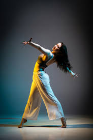

# BDDS Website - Image Guide

## 📸 Images You Need to Add

### **Folder Structure**
```
BDDS-Website/
└── assets/
    └── images/
        ├── hero-bg.jpg
        ├── performance-1.jpg
        ├── performance-2.jpg
        ├── practice-session.jpg
        ├── event-highlight.jpg
        ├── group-performance.jpg
        └── competition.jpg
```

---

## 🎯 Image Requirements

### **1. Hero Section Background**
**File Name:** `hero-bg.jpg`  
**Recommended Size:** 1920x1080px  
**Description:** Dynamic dance image - dancers in action, stage performance, or energetic group shot  
**Where to Use:** Background of the hero section

---

### **2. Gallery Images (6 images needed)**

#### Image 1: `performance-1.jpg`
- **Size:** 800x600px
- **Description:** Solo or group stage performance
- **Mood:** Professional, spotlight, colorful stage

#### Image 2: `performance-2.jpg`
- **Size:** 800x600px
- **Description:** Another performance shot (different angle/style)
- **Mood:** Energetic, dynamic movement

#### Image 3: `practice-session.jpg`
- **Size:** 800x600px
- **Description:** Students practicing in the studio
- **Mood:** Focused, learning environment

#### Image 4: `event-highlight.jpg`
- **Size:** 800x600px
- **Description:** Event/competition moment, awards, or celebration
- **Mood:** Achievement, happiness

#### Image 5: `group-performance.jpg`
- **Size:** 800x600px
- **Description:** Large group synchronized dance
- **Mood:** Unity, coordination

#### Image 6: `competition.jpg`
- **Size:** 800x600px
- **Description:** Competition performance or trophy moment
- **Mood:** Victory, excellence

---

## 🔧 How to Add Images

### **Step 1: Get Your Images**
- Take photos from your academy
- Use stock images from:
  - [Unsplash](https://unsplash.com/s/photos/dance)
  - [Pexels](https://www.pexels.com/search/dance/)
  - [Pixabay](https://pixabay.com/images/search/dance/)

### **Step 2: Rename & Place Images**
1. Rename your images exactly as listed above
2. Place all images in: `BDDS-Website/assets/images/`

### **Step 3: Update HTML**
Open `index.html` and make these changes:

#### **For Hero Background (Line ~30)**
Find:
```html
<section class="hero" id="home">
```

Replace with:
```html
<section class="hero" id="home" style="background-image: url('assets/images/hero-bg.jpg'); background-size: cover; background-position: center;">
```

#### **For Gallery Images (Lines ~150-200)**
Find each `.gallery-placeholder` div and replace with actual images:

**Replace:**
```html
<div class="gallery-item">
    <div class="gallery-placeholder">
        <i class="fas fa-image"></i>
        <p>Performance 1</p>
    </div>
</div>
```

**With:**
```html
<div class="gallery-item">
    
</div>
```

Do this for all 6 gallery items using these image names:
1. `performance-1.jpg`
2. `performance-2.jpg`
3. `practice-session.jpg`
4. `event-highlight.jpg`
5. `group-performance.jpg`
6. `competition.jpg`

---

## 🎨 Optional: Add CSS for Gallery Images

Add this to `style.css` (after line 450):

```css
.gallery-item img {
    width: 100%;
    height: 100%;
    object-fit: cover;
    border-radius: 15px;
    transition: transform 0.3s ease;
}

.gallery-item:hover img {
    transform: scale(1.05);
}
```

---

## 🎬 Optional: Hero Video Background

If you want a video instead of image:

**File Name:** `hero-video.mp4`  
**Location:** `assets/videos/hero-video.mp4`

**Update HTML Hero Section:**
```html
<section class="hero" id="home">
    <video autoplay muted loop class="hero-video">
        <source src="assets/videos/hero-video.mp4" type="video/mp4">
    </video>
    <div class="hero-overlay"></div>
    <div class="hero-content">
        <!-- existing content -->
    </div>
</section>
```

**Add to CSS:**
```css
.hero-video {
    position: absolute;
    top: 0; left: 0;
    width: 100%; height: 100%;
    object-fit: cover;
    z-index: 0;
}
```

---

## 📋 Quick Checklist

- [ ] Download/collect 7 images (1 hero + 6 gallery)
- [ ] Rename images exactly as specified
- [ ] Place in `assets/images/` folder
- [ ] Update hero section in HTML
- [ ] Replace all 6 gallery placeholders with `` tags
- [ ] Add gallery image CSS (optional)
- [ ] Test website locally
- [ ] Deploy to Netlify/Vercel

---

## 🚀 Deployment Instructions

### **Option 1: Netlify (Easiest)**
1. Go to [netlify.com](https://www.netlify.com/)
2. Drag & drop the `BDDS-Website` folder
3. Get instant live URL

### **Option 2: GitHub Pages**
1. Create GitHub repository
2. Upload all files
3. Go to Settings → Pages
4. Select main branch → Save
5. Get URL: `https://yourusername.github.io/repo-name`

### **Option 3: Vercel**
1. Go to [vercel.com](https://vercel.com/)
2. Import GitHub repository
3. Deploy automatically

---

## 💡 Pro Tips

1. **Optimize Images:** Use [TinyPNG](https://tinypng.com/) to compress images before uploading
2. **Consistent Style:** Use images with similar color tones for professional look
3. **High Quality:** Use at least 1200px width for hero image
4. **Mobile Testing:** Check how images look on mobile devices
5. **Alt Text:** Always add descriptive alt text for accessibility

---

## 🆘 Need Help?

If images don't show:
- Check file names match exactly (case-sensitive)
- Verify images are in correct folder
- Check browser console for errors (F12)
- Clear browser cache and refresh

---

## 📞 Contact Info to Update

Don't forget to update these in `index.html`:

- **Phone:** Line ~280 - Replace `+91 98765 43210`
- **Email:** Line ~287 - Replace `info@bdds.com`
- **Address:** Line ~294 - Replace with actual address
- **WhatsApp:** Line ~350 - Replace `919876543210`
- **Google Maps:** Line ~298 - Update embed URL with actual location

---

**Website Created By:** Amazon Q Developer  
**Date:** 2024  
**Tech Stack:** HTML5, CSS3, JavaScript  
**Theme:** Black + Purple + Pink Gradient
